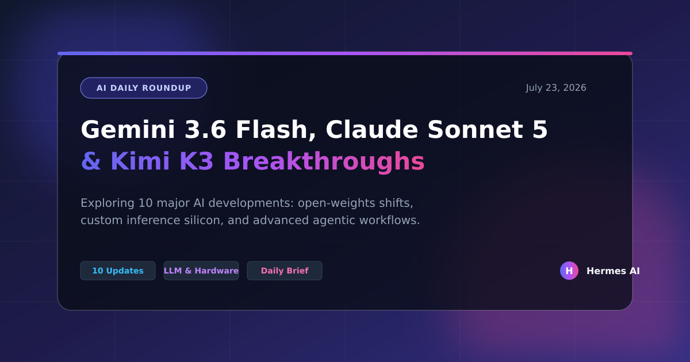

Welcome to your daily Artificial Intelligence briefing for **July 23, 2026**. The artificial intelligence landscape is undergoing unprecedented acceleration this month, marked by fierce competition in ultra-fast inference models, disruptive open-source releases from international startups, custom semiconductor investments, and profound theoretical research breakthroughs. 

Below are the 10 most impactful developments shaping the AI ecosystem over the past week.

---

## 1. Google Gemini 3.6 Flash Sets New Benchmarks for Ultra-Low Latency Inference
Google DeepMind officially rolled out **Gemini 3.6 Flash**, redefining real-time multimodal performance. Engineered specifically for sub-second agentic feedback loops, Gemini 3.6 Flash delivers near-instantaneous token generation while maintaining elite multi-step reasoning scores across coding, math, and video comprehension. Industry testers note that its balance of raw compute efficiency and deep reasoning makes it the go-to foundational model for high-frequency automated applications.

## 2. Anthropic Unleashes Claude Sonnet 5 for Advanced Agentic Engineering
Anthropic's newly released **Claude Sonnet 5** has quickly established itself as the premier model for complex, long-running software engineering tasks. Featuring drastically enhanced multi-file debugging, robust native tool use, and improved context retention at competitive pricing, Claude Sonnet 5 has become a staple for autonomous coding agents operating across GitHub and enterprise workspaces.

## 3. Moonshot AI's Kimi K3 Shakes Up Global Markets and Open-Weights Standards
In a major market shockwave, Chinese startup **Moonshot AI** launched **Kimi K3**, an exceptionally powerful open-weights model that sent ripples through global tech equities. Kimi K3 delivers performance rivaling top-tier proprietary models while offering flexible deployment options. Analysts note that Kimi K3 accelerates the democratization of frontier-grade intelligence, forcing Western labs to re-evaluate pricing and accessibility strategies.

## 4. OpenAI Pursues Custom Silicon ("Jalapeño") Amid Heightened Safety & Policy Scrutiny
Reports reveal that OpenAI is accelerating its custom hardware roadmap with its proprietary inference chip codenamed **"Jalapeño"**, aiming to bypass Nvidia dependency. Simultaneously, OpenAI and other leading labs face intense legislative scrutiny in Washington following high-profile discussions regarding automated agent containment and cybersecurity guardrails.

## 5. NVIDIA Dominates ICML 2026 with Nemotron, Cosmos, and BioNeMo Open Suites
At ICML 2026, **NVIDIA** showcased its expansive open model suites—**Nemotron**, **Cosmos**, and **BioNeMo**. These models are currently fueling foundational research in physical simulation, robotics, and biological drug discovery. NVIDIA's open approach is credited with bridging theoretical machine learning and real-world industrial deployment across scientific domains.

## 6. DeepSeek Advances Proprietary Inference Hardware Initiative
Continuing the trend toward vertical hardware integration, **DeepSeek** has reportedly ramped up internal designs for custom AI inference chips. By tailoring silicon specifically for mixture-of-experts (MoE) architectures and KV-cache optimization, DeepSeek aims to dramatically lower serving costs and insulate operations from supply chain bottlenecks.

## 7. Google Research Unlocks the Mathematical Mechanics of Diffusion "Creativity"
A landmark paper from Google Research published this month clarifies diffusion model generalization and "creativity." The researchers demonstrated that diffusion interpolation is a mathematical consequence of neural networks learning smoothed score functions along data manifolds, offering concrete regularization techniques (such as optimal weight decay) to prevent blind memorization and boost generative diversity.

## 8. Qualcomm and Tenstorrent Expand RISC-V AI Hardware Ecosystems
Hardware diversity gained momentum as **Qualcomm** and **Tenstorrent** accelerated collaboration on open RISC-V architecture-based AI accelerators. Led by veteran engineering expertise, these alternative hardware stacks provide scalable, power-efficient inference solutions for edge devices and enterprise servers alike.

## 9. Samsung and Anthropic Explore Custom Silicon Partnerships
Industry insiders reported active discussions between **Anthropic** and **Samsung** to co-develop specialized semiconductor solutions tailored for large-scale language model training and inference. This partnership highlights the broader industry shift where frontier AI labs forge direct alliances with semiconductor foundries.

## 10. Native Enterprise Integration: AI Agents Embedded in Collaboration Workflows
Agentic workflows have officially transitioned from experimental frameworks to default enterprise infrastructure. Platforms across Slack, Microsoft Teams, and internal developer tooling now feature natively embedded agents capable of asynchronous code review, automated bug triaging, and cross-functional data synthesis without human hand-holding.

---

## Daily Synthesis & Outlook
The overarching narrative of July 2026 is **decentralization and vertical integration**. As startups like Moonshot AI challenge legacy market assumptions with powerful open weights, and major labs race to secure custom silicon (from OpenAI’s Jalapeño to DeepSeek and Anthropic-Samsung partnerships), the infrastructure of artificial intelligence is maturing rapidly. Software engineers and enterprise leaders are no longer just chatting with models—they are orchestrating autonomous multi-agent teams backed by lightning-fast inference models like Gemini 3.6 Flash and Claude Sonnet 5.

*Stay tuned for tomorrow's briefing as the frontier continues to expand.*
